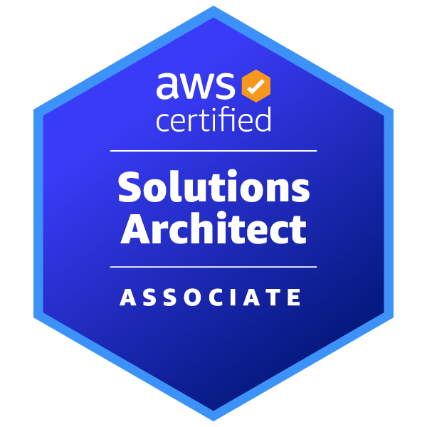
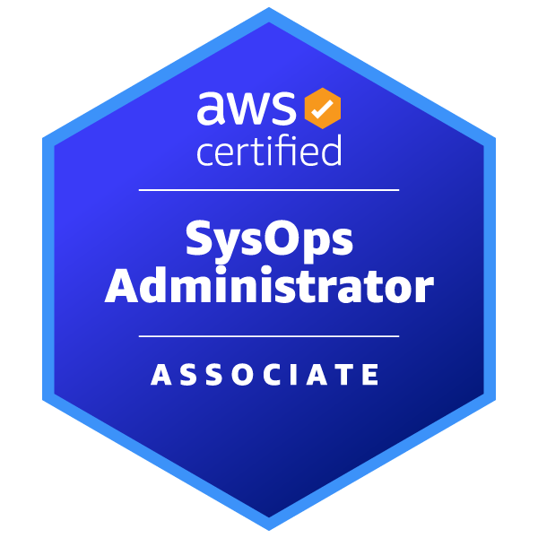
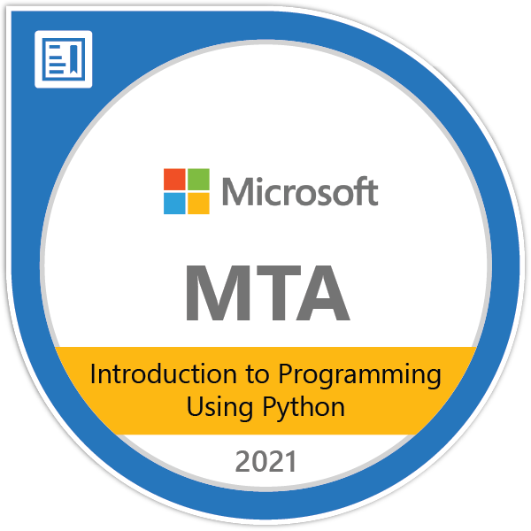
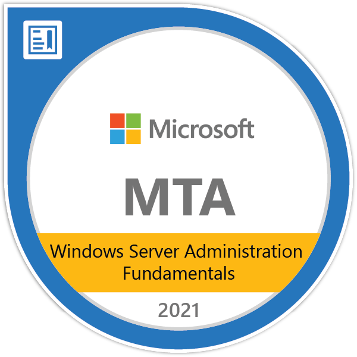
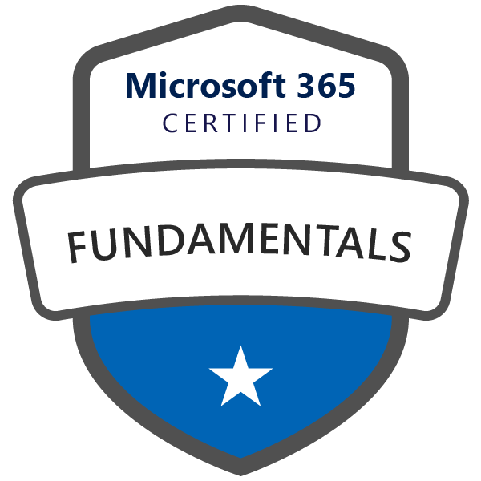

Seattle, WA 
Email: <a href="mailto:james.c.sharp@pm.me">james.c.sharp@pm.me</a>

<h2 align="center">Cloud Certifcations</h2>

    
    
    
    

<h2 align="center">CompTIA Certifications</h2>

    
    
    
    

    
    
    
    

    
<h2 align="center">Microsoft Certifcations</h2>

    
    
    
    
    

    
<h2 align="center">Github Hosted Projects</h2>
<h3 align="center">Amazon Web Services</h3>

<a href="https://sharp275.github.io/WCL-Challenge-One/">Configuring an application load balancer with path-based routing</a>
 
 
<a href="https://sharp275.github.io/WCL-Cloud-Challenge-Two/">Creating an Elastic Beanstalk deployment and a MySQL database</a>
 
 
<a href="https://sharp275.github.io/WCL-Cloud-Challenge-Three/">Migrating an EC2 instance to another region</a>
 
 
<a href="https://sharp275.github.io/WCL-Cloud-Challenge-Four/">Setup a VPC with public and private subnets and a NAT gateway for the private subnet</a>
 
 
<a href="https://sharp275.github.io/WCL-Cloud-Challenge-Five/">Setup a static website using AWS S3</a>
 
 
<a href="https://sharp275.github.io/WCL-Cloud-Challenge-Six/">Configure SNS Email Notification on S3 Bucket Event</a>    

<h3 align="center">IoT Projects and Home Lab</h3>

<a href="https://sharp275.github.io/Public-Environmental-Monitor/">Home Environmental Monitor with Raspberry Pi, InfluxDB, and TagoIO</a>

<a href="https://sharp275.github.io/TM-AC1900-to-RT-AC68U/">Converting an Asus TM-AC1900 to RT-AC68U</a>

<h2 align="center">Education</h2>

ATS, Information Technology (4.0 GPA), Eastern Gateway Community College, Steubenville, Ohio, December 2021 
&nbsp;&nbsp;&nbsp;&nbsp;&nbsp;&nbsp;- Graduated Summa Cum Laude

